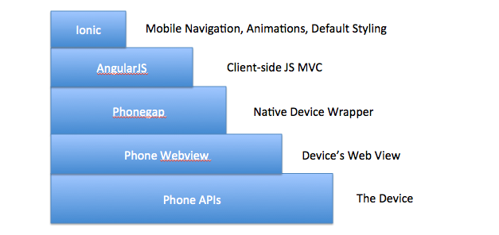

#[Ionic](http://ionicframework.com/)
>**A Hybrid Mobile Development Framework based on AngularJS**


###Objective: Manipulate and Emulate an Ionic App
Ionic is a hybrid app development framework. What is "Hybrid"? A hybrid app uses Phonegap to wrap HTLM, JS, and CSS files into a native web view.


#####Lets look at the ionic stack:



Why did they build it on Angular? - [Because Angular is the most Popular JS Framework](http://www.google.com/trends/explore?hl=en-US#q=angularjs,+ember.js,+knockoutjs,+backbonejs&cmpt=q)

##### Angular-ui-router

Ionic choose to use angular-ui-router to do their routing. Let's look at the ```app.js``` file to understand more about this routing system. Instead of being based on URL, angular-ui-router is based on the concept of **state**. Each state has a URL attached to it, as well as various "views" that are made up of templates and controller pairs. This gives Ionic the flexibility to nest views (such as tab and sidemenu views) together to create an experience similar to common mobile UI. 

```JS
$stateProvider
    .state('contacts', {
        abstract: true,
        url: '/contacts',
        templateUrl: 'contacts.html',
        controller: function($scope){
            $scope.contacts = [{ id:0, name: "Alice" }, { id:1, name: "Bob" }];
        }           
    })
    .state('contacts.list', {
        url: '/list',
        templateUrl: 'contacts.list.html'
    })
    .state('contacts.detail', {
        url: '/:id',
        templateUrl: 'contacts.detail.html',
        controller: function($scope, $stateParams){
          $scope.person = $scope.contacts[$stateParams.id];
        }
    })
```

```
<!-- contacts.html -->
<h1>Contacts Page</h1>
<div ui-view></div>
```

```HTML
<!-- contacts.list.html -->
<ul>
    <li ng-repeat="person in contacts">
        <a ng-href="#/contacts/{{person.id}}">{{person.name}}</a>
    </li>
</ul>
```

```
<!-- contacts.detail.html -->
<h2>{{ person.name }}</h2>
```

Try this example in a [plunker](http://plnkr.co/edit/gmtcE2?p=preview)

###Native vs. Hybrid

Reasons to use native:

1. Faster (especially touch and animation)
2. Can access ALL the device's APIs
3. "Lower Level" (fewer layers of abstraction)
4. Don't have to risk Ionic/Phonegap not being supported in the future

Reasons to use Hybrid/Ionic:
1. Faster to develop
2. iOS and Android
3. You are a web developer (and don't know native!)
4. Phonegap is owned by Apache and Ionic is open source and has raised over $3M (neither are going anywhere)

>**Note**: Ionic is a front end technology. We will not be building any backend or server, so all data and server-side processes will be 'mocked' or 'stubbed out'.

### Deployment

##### Android

Deploying an Ionic app is not hard! But it does requires setting up a string of complex tools and getting them to play nice together. Here are some of the tools you'll need to deploy to android.

1. Eclipses (Java-specific Text Editor)
2. Android SDKs for Eclispses
3. Android Emulator
4. A Google Developer License (Free)

##### iOS
iOS requires a similar pipeline but with iOS tools:
1. Xcode (Objective-C/iOS-specific Text Editor and Emulator)
2. iOS developer license ($100/year)

##### How to Deploy

1. Make AngularJS app work in your browser how you like
2. Add the iOS or Android platform to your project with cordova
3. Build the app into an Xcode/Eclipses project
4. Emulate that project
5. If all is well, package the project into its "Binary" (the file you submit to the app marketplaces)
6. Submit binary to app market places
7. Moonwalk all the way to the 7/11.

### Accessing Device APIs

What if you want to access the GPS, Camera, or other APIs of the device using Cordova? Use [Cordova plugins](http://plugins.cordova.io/#/). These are now managed with [npm](http://cordova.apache.org/announcements/2015/04/21/plugins-release-and-move-to-npm.html). 

Here is an example of a basic implementation of the geolocation API:

```
// onSuccess Callback
// This method accepts a Position object, which contains the
// current GPS coordinates
//
var onSuccess = function(position) {
    alert('Latitude: '          + position.coords.latitude          + '\n' +
          'Longitude: '         + position.coords.longitude         + '\n' +
          'Altitude: '          + position.coords.altitude          + '\n' +
          'Accuracy: '          + position.coords.accuracy          + '\n' +
          'Altitude Accuracy: ' + position.coords.altitudeAccuracy  + '\n' +
          'Heading: '           + position.coords.heading           + '\n' +
          'Speed: '             + position.coords.speed             + '\n' +
          'Timestamp: '         + position.timestamp                + '\n');
};

// onError Callback receives a PositionError object
//
function onError(error) {
    alert('code: '    + error.code    + '\n' +
          'message: ' + error.message + '\n');
}

navigator.geolocation.getCurrentPosition(onSuccess, onError);
```

Here is a list of the most popular Cordova Plugins:

* cordova-plugin-battery-status@1.0.0
* cordova-plugin-camera@1.0.0
* cordova-plugin-console@1.0.0
* cordova-plugin-contacts@1.0.0
* cordova-plugin-device@1.0.0
* cordova-plugin-device-motion@1.0.0
* cordova-plugin-device-orientation@1.0.0
* cordova-plugin-dialogs@1.0.0
* cordova-plugin-file@2.0.0
* cordova-plugin-file-transfer@1.0.0
* cordova-plugin-geolocation@1.0.0
* cordova-plugin-globalization@1.0.0
* cordova-plugin-inappbrowser@1.0.0
* cordova-plugin-legacy-whitelist@1.0.1
* cordova-plugin-media@1.0.0
* cordova-plugin-media-capture@1.0.0
* cordova-plugin-network-information@1.0.0
* cordova-plugin-splashscreen@2.0.0
* cordova-plugin-statusbar@1.0.0
* cordova-plugin-test-framework@1.0.0
* cordova-plugin-vibration@1.0.0

----------

###Getting Started: Project

##### 1. Write User Narratives
"I'm Conny the Coder and I use user narratives to guide my work, write tests, build views, and pick good variable, function, and model names."
##### 2. Make Wireframes

##### 3. Pick tools

We're gonna use Ionic! Why? Can you name 3 reasons? When would you use native? 

##### 3. Make a Step-by-Step Plan (in English)

1. Bootstrap Ionic Project
2. What is your basic navigation? Tabs? Sidemenu? Neither?
3. What are your major files, functions, and variables?

###Getting Started: Ionic

#####1. Install Ionic and cordova with NPM 

```$ npm sudo install -g cordova ionic```

#####2. Then initialize a 'tabs' seed ionic project

```$ ionic start workshop sidemenu```

#####3. lurk around in the code. What do you see?

```
<!-- File structure -->

|hooks
|plugins
|scss
|www <!-- Your Angular App Lives Here -->
.bowerrc
.gitignore
bower.json <!-- For Adding Client-side JS Packages -->
config.xml
gulpfile.js
ionic.project
package.json <!-- For Adding Development Environment and Device Packages -->
```
##### 4. Set Browser to Emulation Mode or Emulate in Virtual Device
```
$ cd workshop
$ ionic serve
Chrome > Developer tools > Console > Emulation > Device: iPhone 6
```
or try emulating an iOS device (might require XCode)
```
$ cd workshop
$ ionic platform add ios
$ ionic build ios
$ ionic emulate ios
```